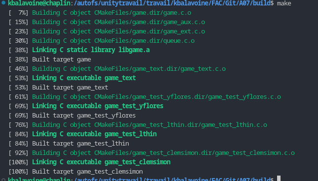

# Évaluation Croisée du Projet

**Projet Évalué** : `[Team]`

## Consignes

Pour chaque question, on attend une réponse courte (oui/non/partiellement) qui
doit être suivie d'une argumentation précise et concise. L’argumentation est
essentielle et doit remplir 2 objectifs : justifier votre réponse courte et
proposer des pistes d’améliorations du code.

Par exemple :

* Question - Le code est-il correctement indenté ?
* Réponse - Partiellement. La fonction truc bidule() du fichier n’est pas
  correctement indentée. Le fichier truc.c n’est pas indenté de la même manière
  que les autres fichiers.

## Questionnaire à remplir

**Question 01** - L’archive du dépôt Git est-elle propre ? (Présence d'un
fichier `README.md` bien écrit, présence des fichiers `.clang-format`,
`.gitignore`, ... Absence de fichiers superflux, temporaires, ou d'exécutables,
...)

Presque tout les fichiers nécessaires sont présents, et il n'y a aucun fichier inutile. En effet, le fichier watermark n'est pas présent. Le README contient toutes les informations nécessaires.

**Question 02** - La compilation se fait-elle correctement ? (Les exécutables et
la bibliothèque sont générés sans erreurs ni warnings.)

Aucune erreurs ni warning ne sont générés lors de la compilation.

**Question 03** - Est-ce que le programme `game_text` s'exécute sans erreurs, ni
bugs ? Arrivez-vous à gagner le jeu par défaut ?

game_text s'exécute sans erreur et sans bug, et le jeu se déroule normalement sans accro.
Il est possible de ganger le jeu par défaut.

**Question 04** - Est-ce que les tests fournis s'éxécutent sans fautes ?
Pouvez-vous ainsi identifier des bugs non corrigés ? Justifiez quelle fonction
ou ligne de code est responsable.

Aucun bug à déplorer, tout s'exécute sans faute.

**Question 05** - Quelle est la couverture du code ? Y a-t-il selon vous
suffisamment de tests, y compris pour les extensions du jeu (v2) ?

La couverture est à 77.83%, ce qui est légèrement insuffisant.
Premèrement, la couverture de la fonction game_print est étrange, avec la moitié des cas tester et l'autre non sans distinction apparente.
Deuxièmement, Il y a beaucoup de redondance, notemment sur les cas d'erreurs, ce qui augmente la quantité de ligne non tester (beaucoup de printf).

**Question 06** - Est-ce que les tests fournis s'exécutent sans fuites mémoire ?
Justifiez quelle fonction ou ligne de code est responsable.

Il n'y a aucune fuite mémoire detecter par le ExperimentalMemCheck.

**Question 07** - La bibliothèque fournie peut-elle remplacer votre propre
bibliothèque sans générer de problèmes ? Vérifiez avec `game_text`.

Tout marche correctement après le remplacement, game_text n'a aucune erreur et tout les tests unitaires se passent sans problèmes.

**Question 08** - Est-ce que la bibliothèque fournie arrive à passer vos tests ?
Pouvez-vous ainsi detécter de nouveaux bugs ou fuites mémoire dans cette
bibliothèque ? Justifiez quelle fonction ou ligne de code est responsable.

`[réponse]`

**Question 09** - A l'inverse, est-ce que les différents exécutables fournis
(`game_text` et tests) fonctionnent avec votre propre bibliothèque ? Justifiez
tout problème découvert, y compris dans votre propre projet.

`[réponse]`

**Question 10** - Est-ce que le code est propre et facilement lisible ?
(Indentation cohérente, nommage cohérent des variables et des fonctions, pas de
constantes magiques, fonctions de longueur raisonnable, pas de code mort ou de
duplication inutile, ...)

`[réponse]`

**Question 11** - Le code est-il suffisament commenté ?

`[réponse]`

**Question 12** - Est-ce que le code est complet et fonctionnel ? Dire si la V1
est correctement implémentée et lister les extensions de la V2 qui sont
correctement implémentées.

`[réponse]`

**Question 13** - Donnez un appréciation générale. Voyez-vous d'autres pistes
d'amélioration ?

`[réponse]`

---
