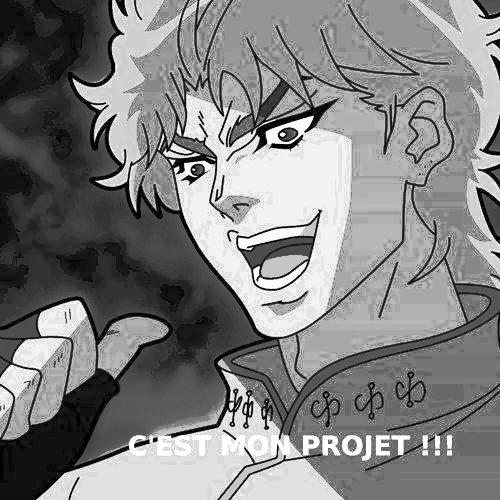
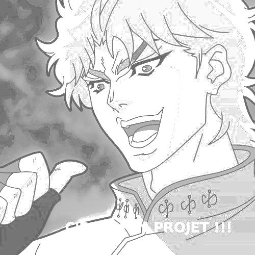
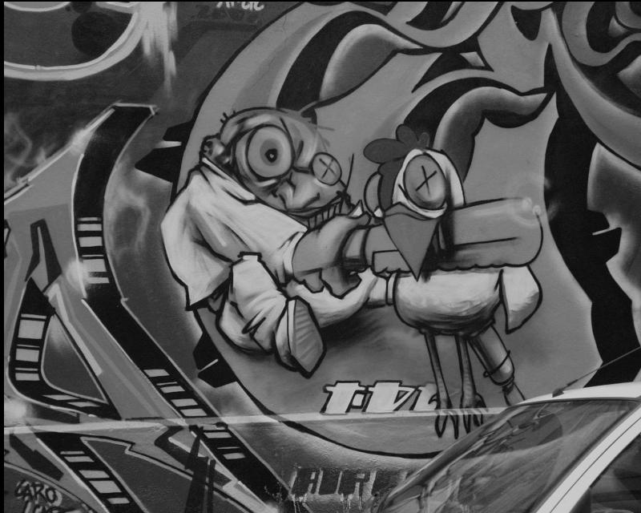
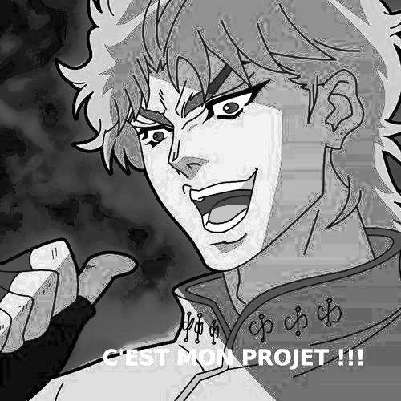
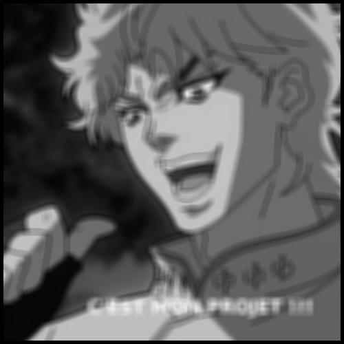
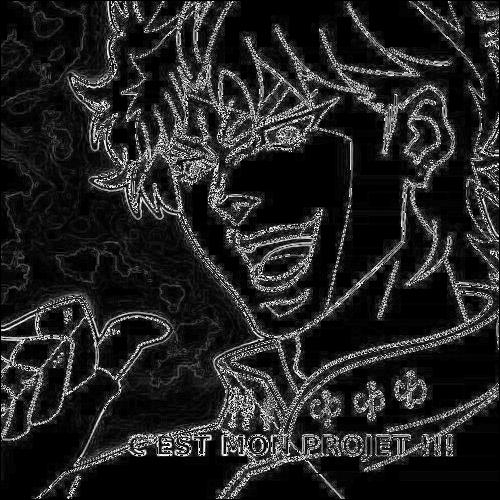
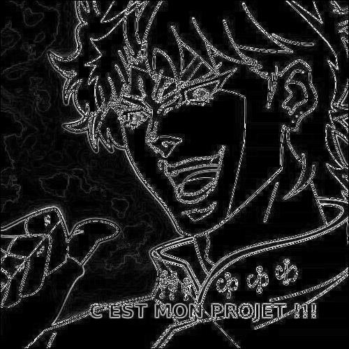
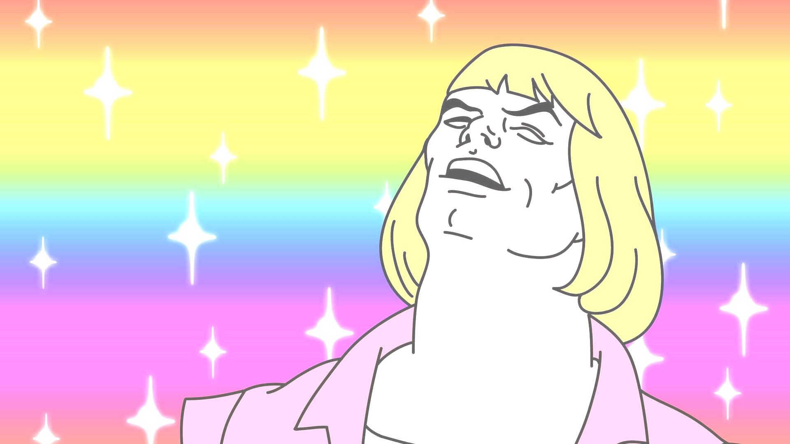
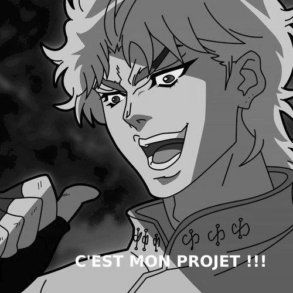
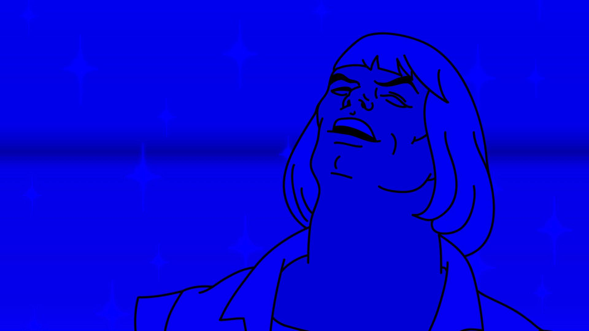

# RENDUS TP3 & TP4
## TP3
### Réglage luminosité
image de base puis image avec 100 de luminosité en plus. 

### Extension dynamique
On peut voir l'image normal, étendue et étendue avec optimisation. 
L'extension dynamique est malheureusement différente pour l'optimisation. 

### Égalisateur d'histogramme

### moyenneur
l'image est avec un filtre de taille 11. 

### convolution
### gradient
les images représente respectivement Sobel et Prewitt. 
j'ai trouvé le même résultat pour les 2. 

## TP4
### Luminosité couleur

### flou couleur
le flou est aussi réalisé avec un filtre 11. 

### Grisage
l'image grisé est celle que j'utilise depuis le début. 

### Conversion RGB -> HSV
Vscode transforme les images en images bleuté si on ne refait pas une conversion à la fin  

### filtre coloré
